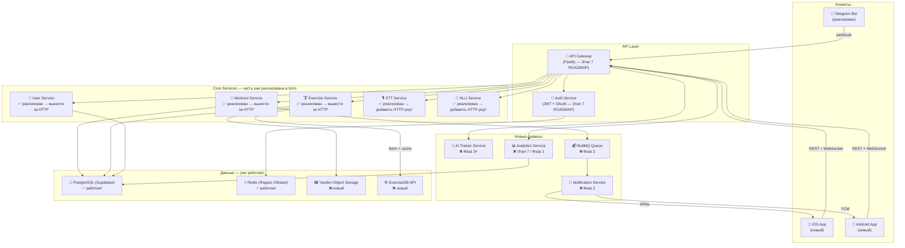
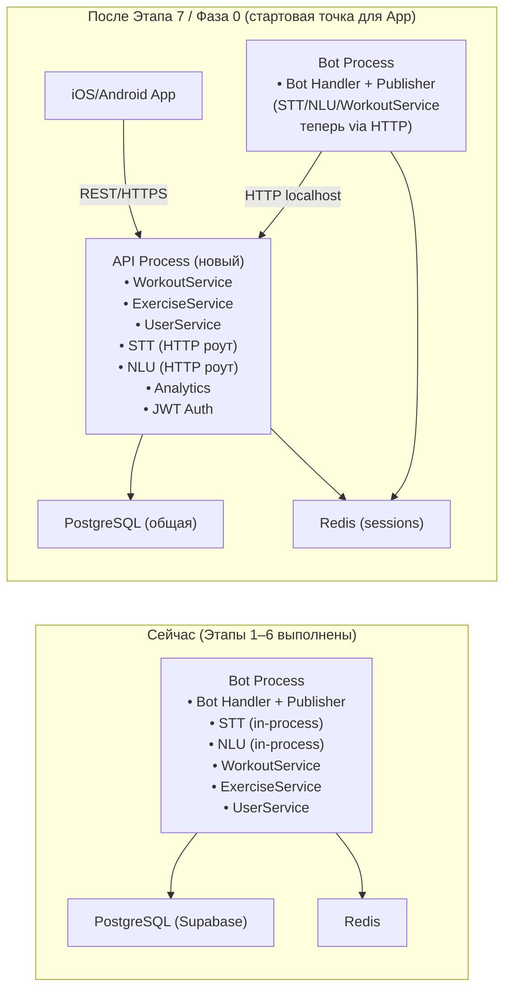
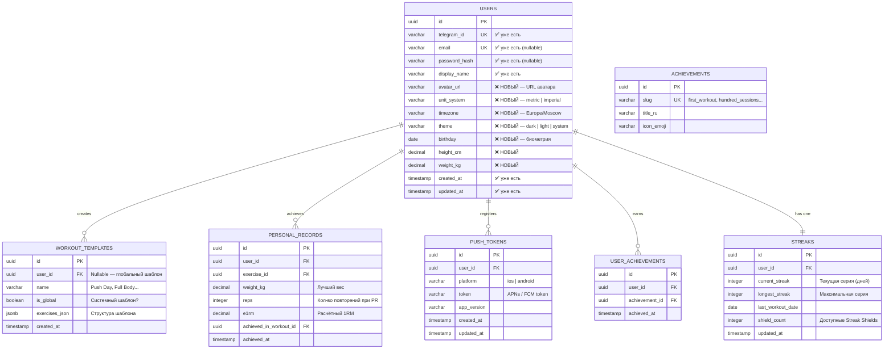
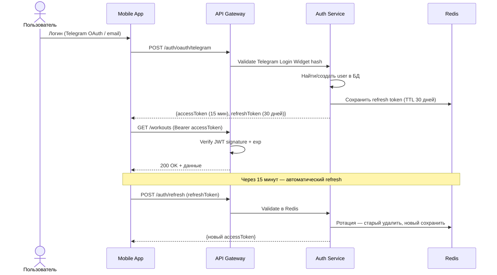
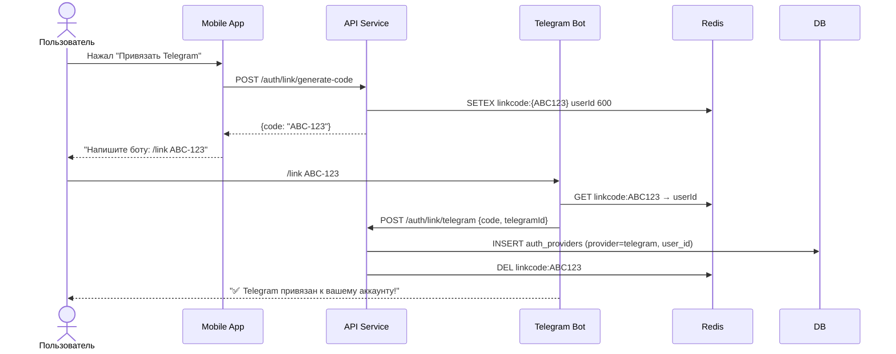
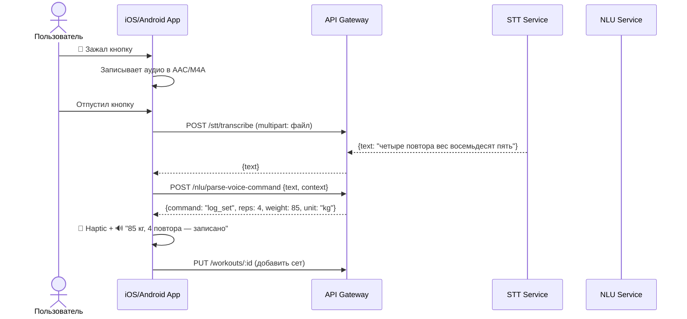
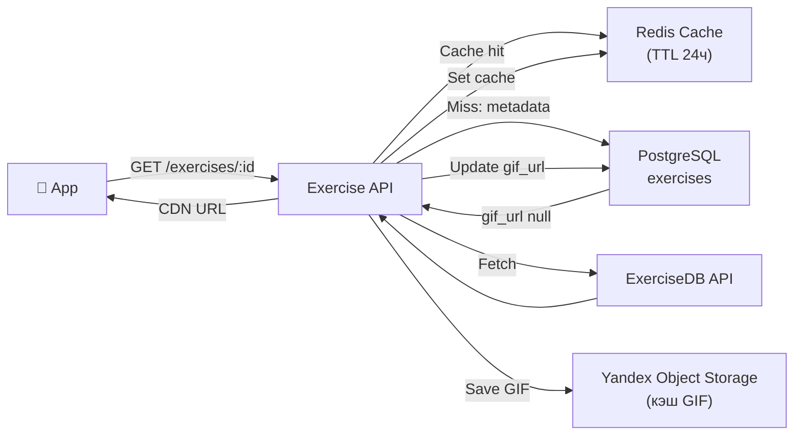
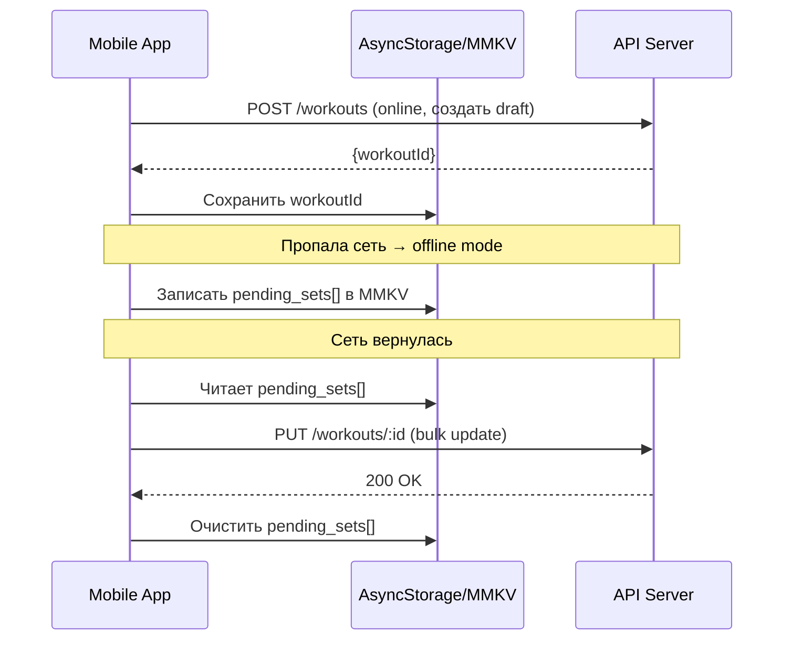
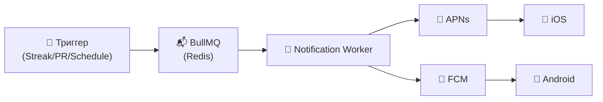

# System Design: FitApp — Мобильное приложение

> [!NOTE]
> Бизнес-требования мобильного приложения: [FIT_APP_BUSINESS_REQUIREMENTS.md](../../../FIT_APP_BUSINESS_REQUIREMENTS.md)
> Системный дизайн Telegram-бота: [SYSTEM_DESIGN.md](./SYSTEM_DESIGN.md)
> Общие бизнес-сценарии и глоссарий: [docs/business/general.md](../../business/general.md)

> [!IMPORTANT]
> **Текущее состояние бота (февраль 2026)**: Реализованы Этапы 1–6 из `ROADMAP.md`. Этап 7 (REST API на Fastify, JWT-авторизация, Analytics Service) **не реализован** и является отправной точкой для интеграции с мобильным приложением. Всё, что в данном документе помечено как «Фаза 0», фактически соответствует Этапу 7 из текущего ROADMAP.md.

## Оглавление

1. [Контекст: что уже есть и что добавляем](#1-контекст-что-уже-есть-и-что-добавляем)
2. [High-Level архитектура (объединённая система)](#2-high-level-архитектура-объединённая-система)
3. [Вынос общей функциональности: что, куда, когда](#3-вынос-общей-функциональности-что-куда-когда)
4. [Расширение модели данных](#4-расширение-модели-данных)
5. [API Gateway и REST API](#5-api-gateway-и-rest-api)
6. [Авторизация в мобильном приложении](#6-авторизация-в-мобильном-приложении)
7. [STT/NLU в мобильном приложении (голосовые функции)](#7-sttnlu-в-мобильном-приложении-голосовые-функции)
8. [Каталог упражнений: ExerciseDB интеграция](#8-каталог-упражнений-exercisedb-интеграция)
9. [Мобильная архитектура (iOS/Android)](#9-мобильная-архитектура-iosandroid)
10. [Offline-режим и синхронизация](#10-offline-режим-и-синхронизация)
11. [Push-уведомления](#11-push-уведомления)
12. [Безопасность](#12-безопасность)
13. [Технологический стек и обоснование выбора](#13-технологический-стек-и-обоснование-выбора)
14. [Стратегия миграции: поэтапный вынос](#14-стратегия-миграции-поэтапный-вынос)

---

## 1. Контекст: что уже есть и что добавляем

### Текущее состояние (после Этапов 1–6 из ROADMAP.md)

Монолитный Node.js-сервис (`apps/bot` в будущем монорепо), реализующий:

| Компонент              | Реализован | Детали                                            |
| ---------------------- | ---------- | ------------------------------------------------- |
| **STT Service**        | ✅ Да      | Deepgram Nova-3, in-process, OGG → текст в памяти |
| **NLU Parser**         | ✅ Да      | DeepSeek V3, JSON mode, ParsedWorkout тип         |
| **WorkoutService**     | ✅ Да      | CRUD, draft-flow, approveDraft/cancelDraft        |
| **ExerciseService**    | ✅ Да      | Синонимы, disambiguation, user mappings           |
| **UserService**        | ✅ Да      | auto-register по telegram_id                      |
| **Publisher**          | ✅ Да      | Публикация в Telegram-канал                       |
| **REST API (Fastify)** | ❌ Нет     | **Этап 7 ROADMAP.md — не реализован**             |
| **JWT-авторизация**    | ❌ Нет     | **Этап 7 ROADMAP.md — не реализован**             |
| **Analytics Service**  | ❌ Нет     | **Этап 7 ROADMAP.md — не реализован**             |
| **БД**                 | ✅ Да      | PostgreSQL (Supabase) + Redis (Яндекс Облако)     |
| **CI/CD**              | ✅ Да      | GitHub Actions → GHCR → Яндекс Облако VM          |

### Этап 7 как фундамент для приложения

Этап 7 из `ROADMAP.md` (7.1 REST API, 7.2 JWT, 7.3 Analytics) — это и есть **Фаза 0** для мобильного приложения. Их нельзя разделить: приложение работает только через REST API, REST API требует JWT-авторизации.

```
ROADMAP.md Этап 7 → FIT_APP Фаза 0:

  7.1 REST API (Fastify, WorkoutService за HTTP)
         ↕ 1:1 соответствие
  Фаза 0, Шаг 1: Вынос сервисов за HTTP API

  7.2 JWT-авторизация
         ↕ 1:1 соответствие
  Фаза 0, Шаг 2: Авторизация (JWT + Telegram OAuth)

  7.3 Analytics
         ↕ подмножество
  Фаза 1: Аналитика (история, PR, тепловая карта)
```

---

## 2. High-Level архитектура (объединённая система)



---

## 3. Вынос общей функциональности: что, куда, когда

### Принципы выноса

> [!IMPORTANT]
> Бот **не ломается** при появлении приложения. Вынос идёт поэтапно: сначала HTTP API над теми же сервисами, потом изоляция. Текущий деплой на Яндекс Облако VM не меняется — добавляется второй процесс.



### Таблица решений: что вынести

| Компонент              | Вынести в API? | Когда           | Обоснование                                                                 |
| ---------------------- | -------------- | --------------- | --------------------------------------------------------------------------- |
| **WorkoutService**     | ✅ Да          | Этап 7 / Фаза 0 | Бот и приложение делают CRUD — нужен единый источник истины                 |
| **ExerciseService**    | ✅ Да          | Этап 7 / Фаза 0 | Каталог нужен обоим; данные одни                                            |
| **UserService**        | ✅ Да          | Этап 7 / Фаза 0 | Профиль, настройки — нужны приложению; бот привязывается через link-account |
| **STT**                | ✅ Да          | Этап 7 / Фаза 0 | Приложение записывает аудио другого формата (AAC, M4A), тот же Deepgram     |
| **NLU**                | ✅ Да          | Этап 7 / Фаза 0 | DeepSeek-парсинг нужен обоим — нет смысла держать двойной код               |
| **Analytics**          | ✅ Да          | Этап 7 / Фаза 1 | Реализован в 7.3, приложение добавляет экраны поверх                        |
| **Publisher**          | ❌ Нет         | Остаётся в боте | Telegram-специфичная логика, приложению не нужна                            |
| **Bot Handler/FSM**    | ❌ Нет         | Остаётся в боте | grammY/conversations — специфика Telegram                                   |
| **AI Trainer Service** | 🆕 Новый       | Фаза 3+         | Новый функционал                                                            |
| **Notification Svc**   | 🆕 Новый       | Фаза 2          | APNs/FCM специфично для приложения                                          |

---

## 4. Расширение модели данных

### Что уже есть в схеме (реализованная часть)

Существующие таблицы из `SYSTEM_DESIGN.md` раздел 4:
`users`, `auth_providers`, `workouts`, `exercises`, `exercise_synonyms`, `user_exercise_mappings`, `workout_exercises`, `exercise_sets`, `workout_comments`

### Новые таблицы для приложения



### Миграция существующих данных

Таблица `users` расширяется через `ALTER TABLE ADD COLUMN ... DEFAULT NULL` — данные существующих пользователей не теряются, новые поля заполняются при первом входе в приложение.

---

## 5. API Gateway и REST API

### Структура API

```
/api/v1/
  auth/
    POST   /register              — Email + password
    POST   /login                 — Email + password → JWT пара
    POST   /refresh               — Refresh token → новый access token
    POST   /oauth/telegram        — Telegram Login Widget
    POST   /oauth/vk              — VK OAuth
    POST   /oauth/google          — Google OAuth (Фаза 2)
    POST   /oauth/apple           — Apple ID (Фаза 2, обязателен для App Store)
    POST   /link/telegram         — Привязать Telegram к существующему аккаунту
    DELETE /logout                — Отозвать refresh token из Redis

  users/
    GET    /me                    — Профиль текущего пользователя
    PATCH  /me                    — Обновить профиль, настройки, биометрию
    GET    /me/streak             — Текущий streak + статистика
    GET    /me/achievements       — Список достижений
    POST   /me/push-token         — Зарегистрировать push-токен устройства
    DELETE /me/push-token/:token  — Удалить push-токен при logout

  exercises/
    GET    /                      — Каталог (фильтры: muscle_group, category, search)
    GET    /:id                   — Карточка упражнения + GIF + инструкции
    POST   /                      — Создать пользовательское упражнение
    GET    /suggestions           — Список для NLU-промпта ({canonical_name, display_name_ru})

  workouts/
    GET    /                      — История (paging, date range, status filter)
    POST   /                      — Создать черновик тренировки
    GET    /:id                   — Детали тренировки с упражнениями и подходами
    PUT    /:id                   — Обновить тренировку
    DELETE /:id                   — Удалить тренировку
    POST   /:id/approve           — Утвердить черновик → сохранить статус approved
    POST   /:id/cancel            — Отменить черновик → удалить
    GET    /heatmap               — Тепловая карта ({date, count}[] за год)
    GET    /active-draft          — Незавершённая тренировка (для баннера «Есть незавершённая»)

  templates/
    GET    /                      — Глобальные + пользовательские шаблоны
    POST   /                      — Создать шаблон из текущей тренировки
    GET    /:id                   — Шаблон с упражнениями
    DELETE /:id                   — Удалить личный шаблон

  analytics/
    GET    /progress/:exerciseId  — Прогресс по упражнению [{date, maxWeight, volume}]
    GET    /volume                — Объём нагрузки за период
    GET    /frequency             — Частота тренировок (totalWorkouts, avgPerWeek)
    GET    /personal-records      — Все PR пользователя
    GET    /muscle-balance        — Анализ дисбаланса мышечных групп

  stt/
    POST   /transcribe            — Аудио (multipart/form-data) → текст
                                    Форматы: OGG, AAC, M4A, WAV, MP4

  nlu/
    POST   /parse                 — {text, exercises} → ParsedWorkout
    POST   /parse-delta           — {text, currentWorkout} → WorkoutDelta
    POST   /parse-voice-command   — {text} → VoiceCommand (hands-free)

  ai-trainer/                     — Фаза 3+
    GET    /recommendations
    GET    /weekly-report
    POST   /adapt-plan
```

### Rate Limiting

| Эндпоинт               | Лимит                   | Причина                          |
| ---------------------- | ----------------------- | -------------------------------- |
| `POST /stt/transcribe` | 60/час на пользователя  | Deepgram — внешний платный вызов |
| `POST /nlu/parse`      | 120/час на пользователя | DeepSeek — платный LLM вызов     |
| `POST /auth/login`     | 10/мин на IP            | Защита от brute force            |
| `POST /auth/register`  | 5/мин на IP             | Защита от спама                  |
| Остальные              | 300/мин на пользователя | Стандартный лимит                |

---

## 6. Авторизация в мобильном приложении

### JWT-стратегия



### Telegram OAuth в мобильном приложении

```
1. Приложение открывает Telegram Login Widget (WebView или deep link)
2. Telegram возвращает: {id, username, first_name, hash, auth_date}
3. Приложение → POST /auth/oauth/telegram с этими данными
4. Бэкенд проверяет HMAC-SHA256(data_check_string, SHA256(BOT_TOKEN))
5. Проверяет auth_date (не старше 86400 секунд)
6. Находит UserService.getOrCreateByTelegram() → JWT пара
```

### Link Account: бот ↔ приложение



---

## 7. STT/NLU в мобильном приложении (голосовые функции)

### Голосовой ввод во время тренировки (PH2-007)



### Голосовые команды (Hands-free)

```typescript
interface VoiceCommand {
  command:
    | 'log_set' // "четыре повтора восемьдесят пять"
    | 'next_exercise' // "следующее упражнение"
    | 'skip_exercise' // "пропустить упражнение"
    | 'finish_workout' // "стоп тренировка"
    | 'query_remaining' // "сколько осталось"
    | 'start_rest_timer' // "таймер отдыха"
    | 'rpe_feedback'; // "тяжело шло", "лёгкий подход"
  reps?: number;
  weight?: number;
  unit?: 'kg' | 'lb';
  rpe?: number; // 1-10
  raw_text: string;
}
```

### Форматы аудио

| Клиент       | Формат аудио              | Конвертация |
| ------------ | ------------------------- | ----------- |
| Telegram Bot | OGG Opus (.oga)           | Не нужна    |
| iOS App      | AAC/M4A (AVAudioRecorder) | Не нужна    |
| Android App  | AAC (MediaRecorder)       | Не нужна    |

> [!TIP]
> Deepgram Nova-3 принимает OGG, AAC, M4A, WAV, FLAC, WebM без конвертации — одна реализация `SttService` покрывает все клиенты.

### iOS: Работа при заблокированном экране

```swift
// AVAudioSession конфигурация для hands-free
try AVAudioSession.sharedInstance().setCategory(
    .playAndRecord,
    mode: .voiceChat,
    options: [.allowBluetooth, .defaultToSpeaker]
)
// Info.plist: UIBackgroundModes: [audio]
// Явный запрос разрешения: NSMicrophoneUsageDescription
```

---

## 8. Каталог упражнений: ExerciseDB интеграция

### Стратегия наполнения каталога

| Вариант                        | Плюсы                                     | Минусы                          | Рекомендация |
| ------------------------------ | ----------------------------------------- | ------------------------------- | ------------ |
| **ExerciseDB API (free tier)** | 1300+ упражнений, GIF, бесплатно          | Rate limit, внешняя зависимость | ✅ App MVP   |
| **wger.de (open-source)**      | Self-hosted, Apache License               | Меньше GIF, качество ниже       | Альтернатива |
| **Собственная база + видео**   | Профессиональный контент, полный контроль | Дорого и долго                  | Фаза 3+      |

### Кэширование GIF



### Расширение таблицы `exercises`

```sql
ALTER TABLE exercises ADD COLUMN IF NOT EXISTS
  description_ru TEXT,
  description_en TEXT,
  instructions    JSONB, -- [{step: 1, text: "..."}]
  common_mistakes JSONB, -- [{mistake: "...", fix: "..."}]
  equipment       VARCHAR[],
  bodyweight      BOOLEAN DEFAULT false,
  gif_url         TEXT,
  gif_cached_at   TIMESTAMP,
  external_id     VARCHAR, -- ID в ExerciseDB
  alternatives    UUID[];  -- Ссылки на похожие упражнения
```

---

## 9. Мобильная архитектура (iOS/Android)

### Выбор платформы

| Вариант                 | Плюсы                                         | Минусы                                 | Рекомендация |
| ----------------------- | --------------------------------------------- | -------------------------------------- | ------------ |
| **React Native + Expo** | TypeScript общий с бэком, один код, EAS Build | Prod. overhead, нативные фичи сложнее  | ✅ App MVP   |
| **Flutter**             | Производительность, google-поддержка          | Dart — другой язык, меньше npm-пакетов | Альтернатива |
| **Native Swift/Kotlin** | Max производительность, нативные API          | Два проекта, двойная поддержка         | Фаза 4+      |

### Структура монорепозитория

```
fit-app/                          ← Монорепозиторий (pnpm workspaces)
  apps/
    bot/                          ← Текущий fit-tel-bot
    api/                          ← Новый Fastify API (Этап 7 ROADMAP)
    mobile/                       ← React Native + Expo
  packages/
    shared-types/                 ← ParsedWorkout, Exercise, User, VoiceCommand...
    shared-config/                ← ESLint, TypeScript конфиги
  docker-compose.yml
  pnpm-workspace.yaml
```

### Структура мобильного приложения

```
apps/mobile/
  app/                          ← Expo Router (file-based routing)
    (auth)/
      login.tsx
      register.tsx
    (tabs)/
      index.tsx                 ← Главный экран (макс. 2 тапа до тренировки)
      workout.tsx               ← Текущая тренировка
      history.tsx               ← История + PR
      catalog.tsx               ← Каталог упражнений
      profile.tsx               ← Профиль + настройки
    workouts/
      new.tsx                   ← Создание тренировки
      [id].tsx                  ← Детали тренировки
      execute/[id].tsx          ← Режим выполнения (hands-free)
  components/
    workout/
      VoiceButton.tsx           ← Кнопка голосового ввода
      SetLogger.tsx             ← Ввод подходов
      RestTimer.tsx             ← Таймер отдыха
      ActivityHeatmap.tsx       ← Тепловая карта (как GitHub)
    exercises/
      ExerciseCard.tsx
      ExerciseGif.tsx
      MuscleGroupFilter.tsx
  hooks/
    useVoiceRecorder.ts         ← Абстракция над AVAudioSession/MediaRecorder
    useWorkoutSession.ts        ← Состояние текущей тренировки
  services/
    api.ts                      ← Axios клиент с автоmatическим refresh
  store/
    workoutSession.store.ts     ← Zustand (активная тренировка + offline queue)
  utils/
    haptics.ts
    audio-feedback.ts           ← TTS-подтверждения голосового ввода
```

---

## 10. Offline-режим и синхронизация



### Хранилище на устройстве

| Данные                      | Хранилище            | TTL              |
| --------------------------- | -------------------- | ---------------- |
| JWT токены                  | SecureStore (Expo)   | До logout        |
| Активная тренировка         | MMKV                 | До завершения    |
| Каталог упражнений          | SQLite (expo-sqlite) | 7 дней           |
| История тренировок (recent) | SQLite               | 30 дней          |
| GIF упражнений              | FileSystem Cache     | 30 дней          |
| Pending sets (offline)      | MMKV                 | До синхронизации |

---

## 11. Push-уведомления

### Архитектура доставки



### Типы уведомлений

| Тип                            | Триггер                               | Время         |
| ------------------------------ | ------------------------------------- | ------------- |
| **Streak-напоминание**         | 2ч до конца дня без тренировки        | По TZ         |
| **Поздравление с PR**          | После approve тренировки              | Немедленно    |
| **Streak Shield использован**  | Пользователь потратил Shield          | Немедленно    |
| **Недельный AI-отчёт**         | Воскресенье 20:00 по TZ пользователя  | По расписанию |
| **Запланированная тренировка** | За 30 мин до запланированного времени | По расписанию |

---

## 12. Безопасность

| Угроза                      | Защита                                                                   |
| --------------------------- | ------------------------------------------------------------------------ |
| JWT кража                   | Access token 15 мин, Refresh rotation, хранение в SecureStore (Keychain) |
| Telegram hash подделка      | HMAC-SHA256 проверка на бэкенде, проверка `auth_date < 86400`            |
| Аудиоданные                 | Buffer только в памяти, не на диск, не в логах                           |
| API abuse                   | Rate limiting по userId/IP, JWT на каждый запрос                         |
| Данные других пользователей | `WHERE user_id = $current` на всех запросах + RLS в Supabase             |
| App Store                   | Privacy Policy, NSMicrophoneUsageDescription, явные запросы разрешений   |

---

## 13. Технологический стек и обоснование выбора

### Бэкенд API

#### Fastify (HTTP-фреймворк)

**Выбор**: Fastify v5 вместо Express/Koa/Hapi.

| Критерий                | Fastify               | Express         | Hapi              |
| ----------------------- | --------------------- | --------------- | ----------------- |
| Производительность      | ✅ ~60k req/s         | ⚠️ ~40k req/s   | ⚠️ ~35k req/s     |
| TypeScript              | ✅ нативная поддержка | ⚠️ через @types | ⚠️ через @types   |
| Схемы (Zod/JSON Schema) | ✅ встроены           | ❌ вручную      | ✅ Joi интеграция |
| Swagger                 | ✅ @fastify/swagger   | ⚠️ сторонний    | ✅ встроен        |
| Экосистема              | ✅ активная           | ✅ огромная     | ⚠️ меньше         |

**Обоснование**: Fastify предлагает лучшую производительность, нативный TypeScript и встроенный механизм схем валидации — критично для API, который одновременно обслуживает бота и мобильное приложение.

#### BullMQ (Task Queue)

**Выбор**: BullMQ поверх существующего Redis вместо RabbitMQ/Kafka.

| Критерий          | BullMQ (Redis)    | RabbitMQ         | Kafka            |
| ----------------- | ----------------- | ---------------- | ---------------- |
| Инфраструктура    | ✅ Redis уже есть | ❌ новый сервис  | ❌ тяжёлая инфра |
| TypeScript        | ✅ нативно        | ⚠️ сторонний     | ⚠️ сторонний     |
| Повторные попытки | ✅ встроено       | ✅ встроено      | ✅ встроено      |
| Гарантия доставки | ✅ at-least-once  | ✅ at-least-once | ✅ at-least-once |
| Масштаб           | ⚠️ до ~10k msg/s  | ✅ высокий       | ✅ очень высокий |

**Обоснование**: Redis уже развёрнут на Яндекс Облако. BullMQ работает поверх него — нулевые операционные расходы на добавление очереди. Kafka/RabbitMQ оправданы на объёмах 10k+ сообщений/с — для push-уведомлений на старте это избыточно.

#### jsonwebtoken (JWT)

**Выбор**: `jsonwebtoken` + RS256 (асимметричные ключи) вместо HS256.

| Критерий       | RS256 (ассиметричный)                        | HS256 (симметричный)    |
| -------------- | -------------------------------------------- | ----------------------- |
| Верификация    | ✅ public key (любой сервис может проверить) | ⚠️ нужен секрет         |
| Ротация ключей | ✅ меняем private, public публикуем          | ⚠️ нужно обновить везде |
| Микросервисы   | ✅ идеально                                  | ⚠️ нужно шарить секрет  |

**Обоснование**: При переходе к микросервисам (Фаза 3) сервисы смогут верифицировать JWT самостоятельно по публичному ключу, без обращения к Auth Service.

### Мобильное приложение

#### React Native + Expo

**Выбор**: React Native с Expo SDK вместо Flutter или Native.

| Критерий                | React Native + Expo           | Flutter                    | Native (Swift/Kotlin)  |
| ----------------------- | ----------------------------- | -------------------------- | ---------------------- |
| Язык                    | ✅ TypeScript (общий с беком) | ❌ Dart                    | ❌ Swift + Kotlin      |
| Переиспользование типов | ✅ shared-types пакет         | ❌ нет                     | ❌ нет                 |
| Time-to-Market          | ✅ один код для iOS/Android   | ✅ один код                | ❌ два проекта         |
| Производительность      | ⚠️ JSI снижает overhead       | ✅ Skia рендеринг          | ✅ максимум            |
| Нативные фичи           | ⚠️ нужены Native Modules      | ✅ через Platform Channels | ✅ всё нативно         |
| CI/CD                   | ✅ EAS Build (Expo)           | ✅ Codemagic/Bitrise       | ✅ Xcode Cloud/Bitrise |
| OTA обновления          | ✅ expo-updates               | ⚠️ Shorebird               | ❌ только App Store    |

**Обоснование**: TypeScript как общий язык — ключевое преимущество. Типы `ParsedWorkout`, `VoiceCommand`, `Exercise` из `packages/shared-types` используются и в API, и в мобильном приложении без дублирования. При необходимости нативных фич (pose estimation в Фазе 4) добавляем Native Modules точечно.

#### Zustand (State Management)

**Выбор**: Zustand вместо Redux/MobX/Jotai.

| Критерий     | Zustand                     | Redux Toolkit | MobX          | Jotai      |
| ------------ | --------------------------- | ------------- | ------------- | ---------- |
| Boilerplate  | ✅ минимум                  | ⚠️ средний    | ⚠️ средний    | ✅ минимум |
| TypeScript   | ✅ нативно                  | ✅ нативно    | ⚠️ декораторы | ✅ нативно |
| Offline sync | ✅ middleware               | ✅ middleware | ⚠️ сложнее    | ⚠️ сложнее |
| DevTools     | ✅ Redux DevTools совместим | ✅            | ✅            | ⚠️         |
| Bundle size  | ✅ ~1.5kb                   | ⚠️ ~15kb      | ⚠️ ~35kb      | ✅ ~3kb    |

**Обоснование**: Zustand — минимальный overhead, идеален для workout session store (мутабельные данные во время тренировки) и offline queue.

#### TanStack Query (Server State)

**Выбор**: TanStack Query (React Query) для кэширования API-запросов.

**Обоснование**: Автоматический кэш, refetch при фокусе (приложение открыто снова), pagination, optimistic updates (записал сет → обновил UI не дожидаясь API). Избавляет от ~60% ручного state management кода для серверных данных.

#### MMKV (Fast Key-Value Storage)

**Выбор**: react-native-mmkv вместо AsyncStorage для критических данных.

| Критерий       | MMKV                             | AsyncStorage         |
| -------------- | -------------------------------- | -------------------- |
| Скорость       | ✅ ~10x быстрее                  | ⚠️ базовая           |
| Синхронный API | ✅ да (блокировки нет, C++ core) | ❌ только async      |
| TypeScript     | ✅                               | ✅                   |
| Шифрование     | ✅ встроено                      | ❌ нужны доп. пакеты |

**Обоснование**: pending_sets[] в offline-режиме должны записываться максимально быстро — пользователь закончил подход и не должен ждать. MMKV критичен именно для workout session.

---

## 14. Стратегия миграции: поэтапный вынос

> [!IMPORTANT]
> **Точка старта**: Этап 7 из `ROADMAP.md` нереализован. Первым делом реализуем его — это и есть Фаза 0.

### Фаза 0: Реализация Этапа 7 ROADMAP.md (Фундамент для App)

Без этого приложение невозможно:

- [ ] **Монорепозиторий** (pnpm workspaces): `apps/bot`, `apps/api`, `packages/shared-types`
- [ ] **Fastify API** (`apps/api`): сервер, cors, helmet, swagger, pino логгер
- [ ] **Перенос сервисов**: `WorkoutService`, `ExerciseService`, `UserService` → HTTP роуты
- [ ] **Адаптация бота**: бот вызывает API через HTTP вместо прямых вызовов сервисов
- [ ] **STT/NLU HTTP-роуты**: `POST /stt/transcribe`, `POST /nlu/parse`, `POST /nlu/parse-delta`
- [ ] **JWT-авторизация**: `jsonwebtoken`, RS256, access 15 мин, refresh 30 дней
- [ ] **Auth роуты**: `/auth/register`, `/auth/login`, `/auth/refresh`, `/auth/oauth/telegram`
- [ ] **Analytics API**: `GET /analytics/progress/:exerciseId`, `/volume`, `/frequency`
- [ ] **Миграция схемы БД**: новые поля в `users`, новые таблицы (`personal_records`, `streaks`, `push_tokens`)
- [ ] Обновить `ROADMAP.md`: пометить Этап 7 как приоритет №1

### Фаза 1: App MVP (CF-001 — CF-004 из бизнес-требований)

- [ ] Expo проект: настройка, навигация (Expo Router), темизация
- [ ] Авторизация в приложении (Telegram OAuth, JWT хранение в SecureStore)
- [ ] Каталог упражнений: список, фильтрация, карточка + GIF (ExerciseDB)
- [ ] Создание тренировки: выбор упражнений, ввод подходов
- [ ] Режим выполнения: таймер отдыха, счётчик подходов, drag & drop
- [ ] История тренировок: список, детали, тепловая карта
- [ ] PR-детекция и Badge

### Фаза 2: Голос + Уведомления (PH2-005 — PH2-007)

- [ ] `POST /stt/transcribe` — поддержка AAC/M4A от мобильного приложения
- [ ] `POST /nlu/parse-voice-command` — hands-free команды с контекстом
- [ ] VoiceButton компонент + useVoiceRecorder hook
- [ ] Haptic feedback + аудио-эхо TTS
- [ ] iOS Background Audio mode
- [ ] BullMQ + APNs + FCM Notification Worker
- [ ] expo-notifications интеграция
- [ ] Streak система, Shield механика, Achievements
- [ ] Apple Health / Google Fit интеграция (PH2-006)
- [ ] Apple/Google OAuth (PH2-001)

### Фаза 3: AI-тренер (KF-002)

- [ ] `AI Trainer Service`: анализ нагрузки, адаптация плана
- [ ] Недельные AI-отчёты через BullMQ
- [ ] Предупреждения о перетренированности
- [ ] Анализ дисбаланса мышечных групп
- [ ] Friends API: social graph, challenges (KF-004)
- [ ] Монетизация: RevenueCat in-app purchases

### Фаза 4: Pose Estimation (KF-005)

- [ ] Apple Vision Framework / ML Kit интеграция
- [ ] Pose estimation on-device для ключевых упражнений
- [ ] Детекция ошибок техники с временными метками
